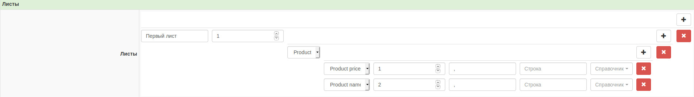

[](https://packagist.org/packages/execut/yii2-import)
[](https://travis-ci.com/execut/yii2-import)
[](https://coveralls.io/github/execut/yii2-import)
[](https://scrutinizer-ci.com/g/execut/yii2-import?branch=master)
[](https://insight.sensiolabs.com/projects/db48bc7b-66e9-492c-8848-fc6a52f133bd)
[](https://packagist.org/packages/execut/yii2-import/stats)

# yii2-import
Yii2 module for import data from files to database between activeRecord

## Installation

The preferred way to install this extension is through [composer](http://getcomposer.org/download/).

### Install

Either run

```
$ php composer.phar require execut/yii2-import "dev-master"
```

or add

```
"execut/yii2-import": "dev-master"
```

to the ```require``` section of your `composer.json` file.

### Configuration

Add module bootstrap and application language in target web application config:
```php
    ...
    'language' => 'ru',
    'bootstrap' => [
    ...
        'import' => [
            'class' => \execut\import\bootstrap\Backend::class,
        ]
    ...
    ],
```

Add module bootstrap in console application config:
```php
    'bootstrap' => [
    ...
        'import' => [
            'class' => \execut\import\bootstrap\Console::class,
        ]
    ...
    ],
```

For activate i18n translation set you application language in  config:
```php

```

Apply migrations via yii command:
```
./yii migrate/up --migrationPath=vendor/kartik-v/yii2-dynagrid/src/migrations
```

After configuration, the module should open by paths:
import/files
import/settings

### Module navigation

You may output navigation of module inside your layout via execut/yii2-navigation:
```php
    echo Nav::widget([
        ...
        'items' => \yii\helpers\ArrayHelper::merge($menuItems, \yii::$app->navigation->getMenuItems()),
        ...
    ]);
    NavBar::end();

    // Before standard breadcrumbs render breadcrumbs and header widget:
    echo \execut\navigation\widgets\Breadcrumbs::widget();
    echo \execut\navigation\widgets\Header::widget();
```
For more information about execut/yii2-navigation module, please read it [documentation](https://github.com/execut/yii2-navigation)

### Описание разделов
#### Файлы

По адресу import/files происходит управление файлами, которые импортируются. Здесь можно вручную загружать новые
и управлять загрузками. Каждому файлу можно выставить статусы и консольная команда для импорта подхватит его:
* New - загрузить файл
* Reload - перезагрузиь файл
* Delete - удалить файл
* Loaded - файл загружен
* Stop - остановить загрузку
* Error - ошибка загрузки файла

Остальные статусы используются консольной командой для отображения процесса импорта и если их выставить вручную,
поведение импорта непредсказуемо:
* Loading - файл в процессе импорта
* Stopped - импорт файла остановлен
* Deleting - файл в процессе удаления

#### Настройки

По адресу import/settings можно управлять настройками, через которые происходит захват файлов их внешних источников,
разбор файлов на данные и их запись в базу данных.

Чтобы начать производить настройки импорта, модулю необходимо указнать про ваше окружение базы данных через реализацию
плагина execut\import\Plugin. Подробнее о том как реализовать этот плагин, смотрите раздел
[создание плагинов](#создание-плагинов)

#### Консоль

В консоли есть 3 команды:
##### import
Команда ./yii import запускает процесс импорта и удаления файлов. Этот процесс пошагово выглядит так:
1. Отбирается самый старый по дате создания файл со статусом New и Reload
2. Удаляется старый файл с такой-же настройкой как и новый
3. Происходит его парсинг и запись в БД
4. Шаг 1 повторяется

Эта команда поддерживает её параллельный запуск для большей скорости импорта.
У команды есть единственный необязательный аргумент: идентификатор файла, который необходимо импортировать. Если его
передать, то указанный файл начнёт импортироваться через шаги 1-3. После выполнения шага 3 процесс выполнения команды
обрывается

##### import/check-source
./yii import/check-source выполняет процесс захвата файлов из внешних источников через настройки и их запись в базу для
последующего запуска.
Аргументы команды:
* type - тип источника. Может быть email, ftp или site.
* id - идентификатор настройки. Если указать его, то произойдёт захват только указанной настройки.

Команда поддерживает параллельный запуск.

##### import/release-trigger
./yii import/release-trigger очищает все mutex-триггеры. Применяется для случаев, если произошёл сбой при выполнении
команд для разблокировки их дальнейшего выполнения.


#### Создание плагинов

##### Создание простых записей
Для изучения принципа создания плагина, рассмотрим простой пример. У нас есть товар. У товара есть название и цена.
Нам нужно импортировать этот товар в базу данных каталога.
Применим миграции примера:
```ssh
./yii migrate/up --migrationPath=vendor/execut/yii2-import/example/migrations
```

Подключим плагин простого плагина через конфигурационные файлы двух приложений консольного и web, в тех строках, что мы
задавали раннее для запуска модуля:
```php
                'import' => [
//'class' => \execut\import\bootstrap\Console::class,
                    'depends' => [
                        'modules' => [
                            'import' => [
                                'plugins' => [
                                    'simple' => [
                                        'class' => \execut\import\example\Plugin::class,
                                    ],
                                ],
                            ],
                        ],
                    ],
                ],
```

После этого в админке настроек импорта появляется возможность задавать настройки для ипорта товаров с
двумя полями: названием и ценой.
Перейдём по адресу import/settings и создадим в этой админке настройку со следующими полями:

1. Название: Простой товар
1. Пропустить строк: 1
1. Кодировка файла: UTF-8
1. Источник захвата файла: Вручню
1. Листы
   1. Название: Первый лист
       1. Тип: Product
           1. Тип: Product name, Колонка: 1
           1. Тип: Product price, Колонка: 2



В результате мы настроили возможность загружать файл, расположенный внутри папки компонента: example/data/products.gnumeric
Попробуем его загрузить через админку файлов импорта import/files, выбрав следующие значения полей:
1. Файл: выбираем файл example/data/products.gnumeric
1. Настройки: выбираем раннее созданную настройку "Простой товар"
1. Источник захвата файла: Вручную

И пробуем этот файл загрузить в базу через консольную команду:
```bash
> ./yii import
Start check failed files
End check failed files
Start parse file #1 products.gnumeric
start extract example_product_id
start construct where example_product_id
end construct where example_product_id after 0.0058150291442871 seconds
start find example_product_id
end find example_product_id after 0.014003992080688 seconds
start keys collect example_product_id
end keys collect example_product_id after 4.0531158447266E-6 seconds
start models collect example_product_id
end models collect example_product_id after 0.24526405334473 seconds
end extract example_product_id after 0.26518106460571 seconds
Row #0: Saving example_products # a:2:{s:4:"name";s:1:"1";s:5:"price";s:9:"Product 1";} because they is created
Row #1: Saving example_products # a:2:{s:4:"name";s:1:"2";s:5:"price";s:9:"Product 2";} because they is created
Row #2: Saving example_products # a:2:{s:4:"name";s:1:"3";s:5:"price";s:9:"Product 3";} because they is created
...
```

В результате импорта в таблице example_products должны появиться 2500 товаров

##### Создание записей через связи

Расширим пример выше, но, уже импортируя товар через артикулы. Для этого подключим другой плагин указанным выше образом:
```
execut\import\example\withRelations\Plugin
```
Этот плагин позволит загружать и синхронизировать товары по связке их артикул\производитель. Необходимо скорректировать
созданную раннее настройку, указав 3 и 5 столбец как Article и Brand соответственно.
После этого указываем статус файла "Перезагрузить" и загружаем его вновь:
```bash
> ./yii import
```

После этого должны появиться 3 производителя, 2499 их артикулов и 2499 товаров с ними.
Если попробовать вновь загрузить файл, то ничего не должно измениться в БД, поскольку изменений в файле не было.

##### Усложненный поиск записей

Есть возможность усложнить поиск записей, если, например, в файлах один и тот-же производитель может называться по разному.
Для этого модели производителя необходимо наследовать интерфейс execut\import\ModelInterface и вычислить в нём все
возможные варианты названия активного производителя, а в объекте запроса ActiveQuery для этой модели унаследовать
execut\import\Query и в нём задать новый способ поиска.